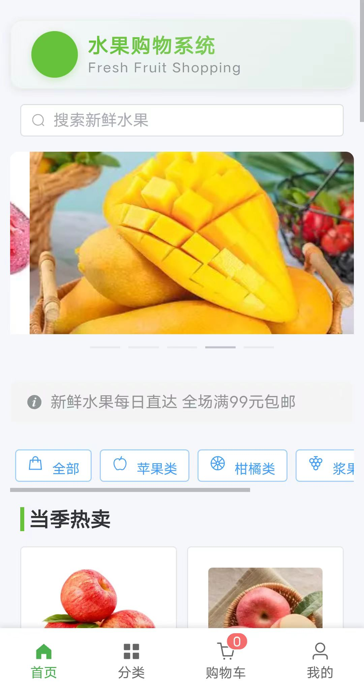
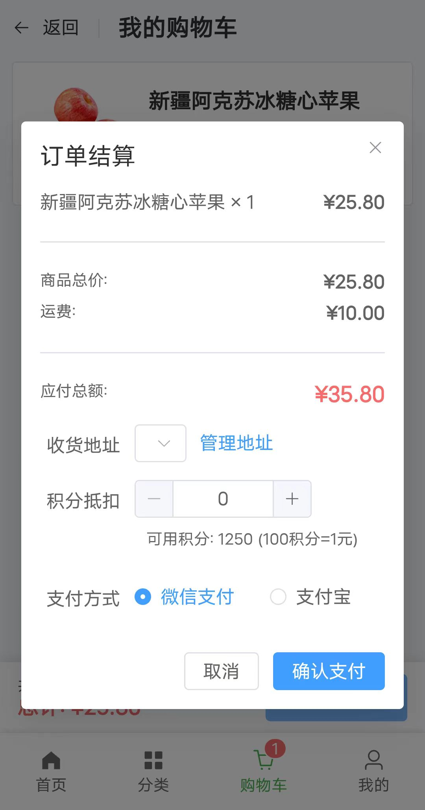
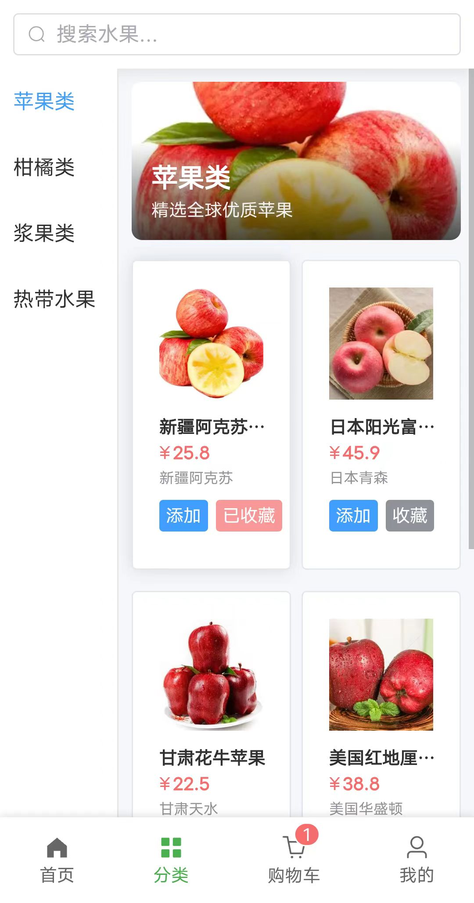
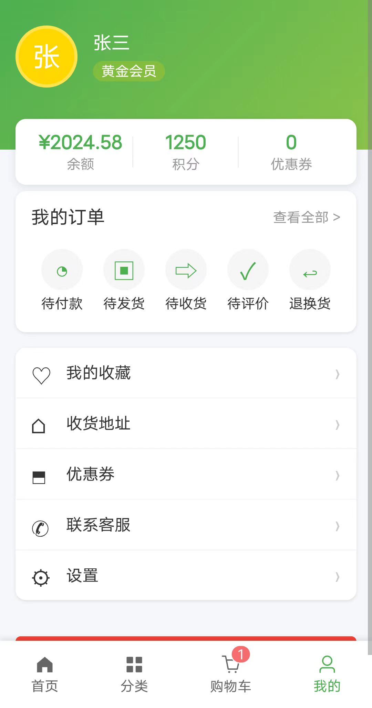
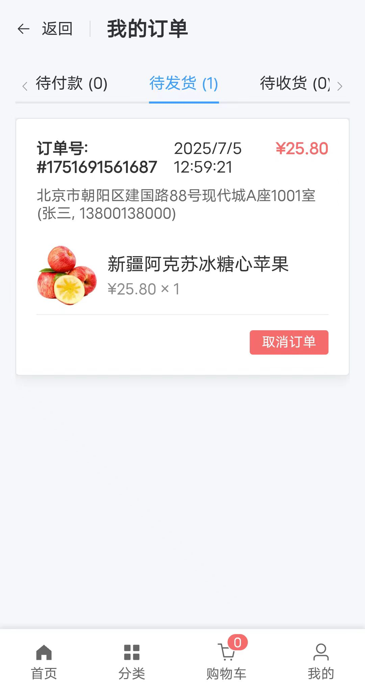
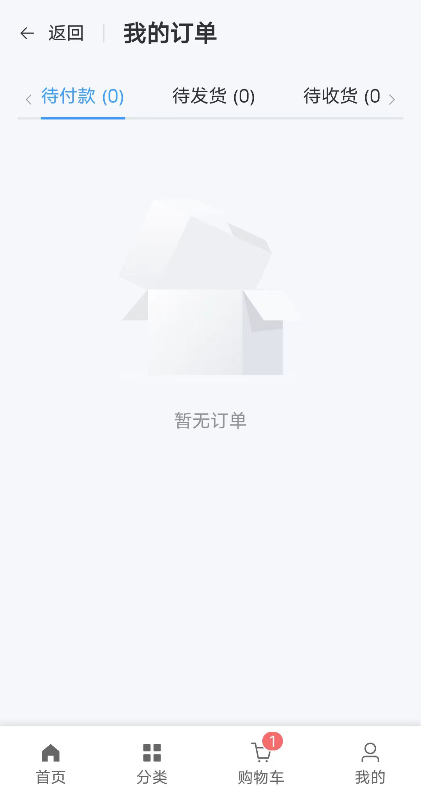

# 水果购物系统

## 项目简介
一个基于 Vue 3 + Element Plus 的现代化水果电商平台，包含以下核心功能：
- 水果分类浏览（苹果类/柑橘类/浆果类/热带水果）
- 购物车管理（增删改查/结算）
- 用户系统（登录/注册/个人中心）
- 订单管理（创建/支付/取消）
- 收藏夹功能
- 客服中心

## 技术栈
- 前端框架：Vue 3
- 构建工具：Vite        
- 路由管理：Vue Router      
- UI组件库：Element Plus            
- 状态管理：Pinia

## 不足之处
- 没有后台数据库，数据存储在本地
- 没有支付功能，仅为演示功能
- 没有用户登录注册功能，仅为演示功能，刷新可重新登录
- 部分功能未实现，仅为演示功能（如客服中心、订单管理等）
- 部分页面未完成（如个人中心、收藏夹等）

## Vue 项目手机预览指南
1. 确保手机和电脑连接**同一 WiFi**。
2. 在电脑上启动 Vue 开发服务器。
- 使用以下命令启动开发服务器：
    ```bash
      npm run dev
      或者
      yarn dev

- 控制台会显示如下内容：
    ```bash
  ➜  Local:   http://localhost:5173/
  ➜  Network: http://192.168.xxx.xxx:5173/ 
    ```
3. 在手机浏览器中输入上述地址，即可访问 Vue 项目。

## 项目结构
```bash
src/
├── assets/          # 静态资源
├── components/      # 公共组件
│   └── BottomNav.vue # 底部导航
├── img/             # 图片资源
├── SomeDisplays/    # 部分截图展示
├── router/          # 路由配置
├── store/           # 状态管理
├── views/           # 页面组件
│   ├── Cart.vue      # 购物车
│   ├── Category.vue  # 分类页
│   ├── Home.vue      # 首页
│   ├── Login.vue     # 用户中心
│   └── ...          # 其他页面
├── App.vue          # 根组件
└── README.md
```
## 部分截图展示 






